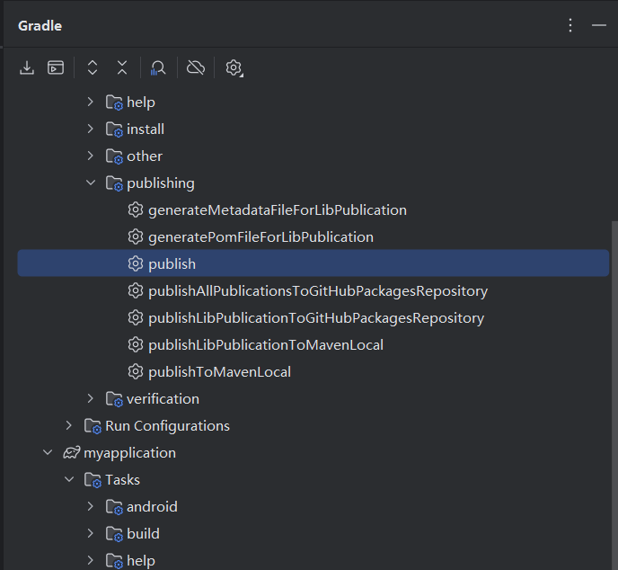
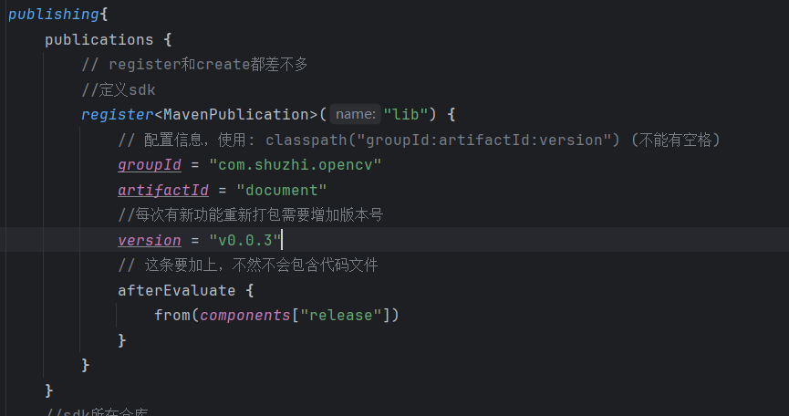

# opencv
 毕业设计 lens

为了实现方便后期接入物品管理 本项目分为了两个module
### app module 
为功能实现 并作为sdk
sdk 打包 发布 点击publish就行

每次修改发布需要增加版本号 位于app module 的build.gradle 文件里面

### myapplication module 
为测试module 不提供具体功能 方便后期打包sdk 接入物品管理
sdk的入口为 app module下的 MainActivity 直接启动就行

####依赖方式：
implementation("com.shuzhi.opencv:document:v0.0.3")

并且要注意在接入的setting.gradle 中 填入仓库https://maven.pkg.github.com/2631140624/my-lens 和验证方式

####application 初始化
sdk 有些功能需要提前初始化 ，需要在介入方的application类的 onCreate 中调用 OpenCvApp.doOnApp(this)方法初始化

###开发注意事项
本项目使用compose开发 hilt作为依赖注入
使用MVVM架构 compose ->view model ->repository